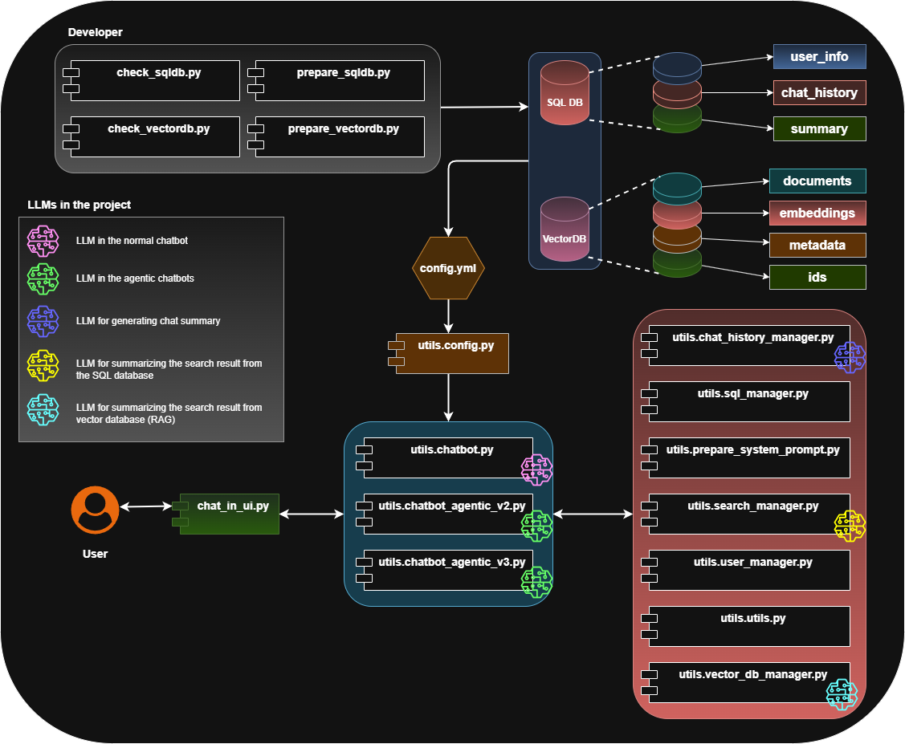

# 🧠 Agentic Long-Term Memory

This project explores the concept of long-term memory in AI agents and demonstrates how to build agentic memory systems using various approaches and tools. 

Feel free to ⭐️ the repo if it helps you understand long-term memory for agents!

## 📚 What You'll Learn
1. How to design a **custom agentic long-term memory**.
2. How to implement **long-term memory using Vector DB and Graph DB** with **LangChain** and **LangGraph**.
3. How to structure memory into **semantic**, **episodic**, and **procedural** components (based on the [LangChain CEO's course on DeepLearning.ai](https://www.deeplearning.ai/)).
4. A brief overview of **letta's long-term memory model**.

🔗 A great reference paper for this project:  
[Memory in LLM Agents](https://arxiv.org/abs/2310.08560)  
PDF available in the repo: `letta/MemGPT_Paper.pdf`

## ▶️ Watch the Demo  
📺 **YouTube Video:** _Coming soon..._


## 💾 How to Run the Project

1. **Create a virtual environment**  
   ```bash
   python -m venv venv
   source venv/bin/activate  # or venv\Scripts\activate on Windows
   ```
2. Install dependencies
    ```bash
    pip install -r requirements.txt
    ```
3. Prepare the databases for the custom chatbot
    ```bash
    python src/prepare_sqldb.py          # Setup SQLite DB  
    python src/check_sqldb.py            # Inspect DB contents  
    python src/prepare_vectordb.py       # Setup Vector DB  
    python src/check_vectordb.py         # Inspect Vector DB 
    ```
4. Run the chatbots
    - Run in terminal:
        ```bash
        python src/bot.py
        ```
    - Run with Gradio UI (all 3 chatbot versions available):
        ```bash
        python src/bot_ui.py
        ```
    
# Project Schemas:
**LLM Default Behavior**


**Concept of Memory**


**Basic Chatbot Schema**


**Agentic_Chatbot_v2 Schema**


**Agentic_Chatbot_v3 Schema**


**Longterm Memory with Graph DB and Vector DB using LangGraph**


**Longterm Memory (Semantic, Episodical, and Procedural) with LangGraph**


🧩 Technologies Used
- Python
- openai
- LangChain
- LangGraph
- SQLite
- Chroma (Vector DBs)
- Gradio (UI)

📂 Project Structure (High-Level)
```bash
src/
├── bot.py                     # Terminal-based chatbot
├── bot_ui.py                  # Gradio UI version
├── prepare_sqldb.py           # Creates SQLite DB
├── prepare_vectordb.py        # Creates Vector DB
├── check_sqldb.py             # Checks SQLite DB contents
├── check_vectordb.py          # Checks Vector DB contents
└── utils/
    ├── chat_history_manager.py
    ├── chatbot_agentic_v1.py
    ├── chatbot_agentic_v2.py
    ├── chatbot.py
    ├── config.py
    ├── prepare_system_prompt.py
    ├── search_manager.py
    ├── sql_manager.py
    ├── user_manager.py
    ├── utils.py
    └── vector_db_manager.py

langgraph/
├── online-course/             # Memory system from DeepLearning.ai course
└── website-tutorial/          # Tutorial-based memory system

letta/
├── chatbot_with_longterm_memory.py
└── MemGPT_Paper.pdf           # Research paper reference

data/
├── vectordb/
└── chatbot.db

images/

├── requirements.txt
```
**`src` Folder Structure**



