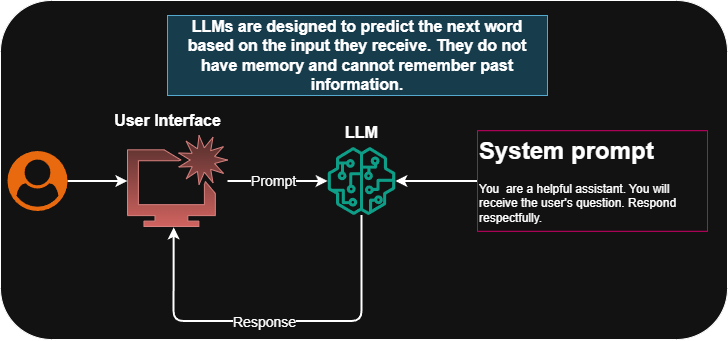

---

# Why LLMs Don't Have Memory by Default

Large Language Models (LLMs) like GPT are incredibly powerful at generating human-like text. However, **they do not have memory by default**, which means:

- They **do not remember previous interactions** across different sessions.
- They **cannot persist knowledge** about users, past conversations, or ongoing tasks beyond the current input context.


## 🧠 What "No Memory" Really Means

Unlike humans or stateful systems, LLMs are:

- **Stateless**: Every prompt is treated as a new request with no awareness of the past.
- **Context-limited**: They only "see" what’s in the current prompt.


## 📦 How LLMs Process Input




Once the response is generated, **the model forgets everything**. It doesn’t save or retain anything unless the developer explicitly does it.


## ⚠️ Why This Matters

Without memory:
- Users must repeat context in long conversations.
- LLMs cannot adapt or personalize over time.
- Multi-step reasoning and task completion become limited.


## 🛠️ Workarounds (Implemented by Developers)

To overcome this limitation, **memory layers can be built on top of LLMs**, such as:
- Storing chat history in databases and with different formats (SQL database, Vector database, Graph database, etc.)
- Using vector stores for long-term semantic memory
- Using graph databases for more structured, relationship-aware memory — e.g., capturing user interests, connections, and contextual metadata
- Summarizing past interactions to stay within token limits while preserving context
- Implementing agentic loops with tool usage to populate the system instructions based on the user's feedback over time

These enhancements simulate "memory" and let the chatbot appear intelligent, persistent, and context-aware.

```markdown
> **Bottom line:** LLMs are powerful but forgetful. Memory must be engineered externally to unlock their full potential.
```