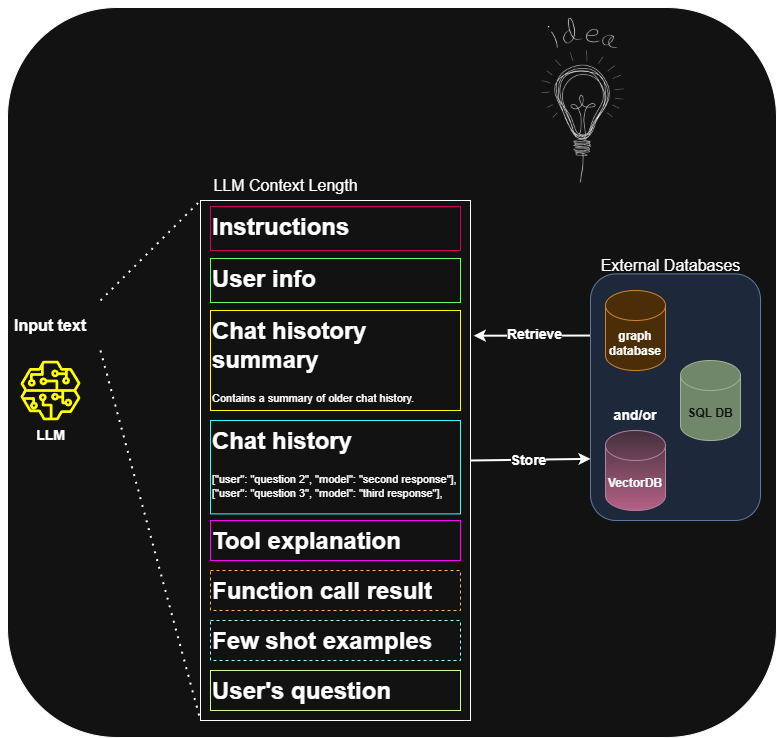

## 🧠 Understanding Memory in LLMs

Now that we know LLMs don’t come with memory by default, let’s talk about what it *really* means to **give memory** to a language model.

At a high level, memory is not a magical internal ability of the model — it’s something we build around it.

In practice, **memory is the combination of `tools`, `databases`, and `strategies`** that allow the system to *simulate* remembering. That means:
- Deciding **what to store**
- Figuring out **how to retrieve it later**
- And then, most importantly, **where and how to include it in the prompt** to guide the LLM effectively

---

## 📊 Let’s Look at the Schema

If you look at the diagram, you’ll see a breakdown of how memory-enhanced LLMs work behind the scenes.

We start on the left with the **LLM input text**, often called the *prompt*. This prompt is built dynamically and includes many building blocks:

- **Instructions**: The overall behavior you want the model to follow
- **User info**: Pulled from a database, this can include things like user preferences, tone, or goals
- **Chat history summary**: A compressed version of older messages, helping preserve context without using too much space
- **Chat history**: Recent turns in the conversation
- **Tool explanation**: A section that tells the model what tools it has access to and how to use them
- **Function call result**: If the model called a tool previously, this section reports what came back
- **Few-shot examples**: Examples that help steer the model’s behavior
- And finally, **the user’s latest question**

---

## 🗃️ External Databases = Memory Sources

On the right side of the schema, you’ll see **external databases** — these are key to memory:

- A **VectorDB** stores past interactions as embeddings and enables *semantic search*
- A **SQL database** might store structured chat history or user preferences
- A **Graph database** captures relationships and user-specific knowledge — like their network, interests, or even goals

---

## 🧩 The Real Challenge: Smart Prompt Construction

The magic isn't just in storing data — it’s in how we use it.

The system retrieves the *most relevant* pieces of information from these databases and places them into the right sections of the prompt. This is what gives the illusion of memory. The LLM still doesn't "know" anything — but it's operating with just enough context to appear intelligent, aware, and consistent.

So memory in LLMs is not one thing — it’s a **layered design**. A system built around the model that stores knowledge, retrieves it smartly, and guides the model’s thinking over time.

This architecture is what separates a basic chatbot from a powerful, adaptive assistant.
